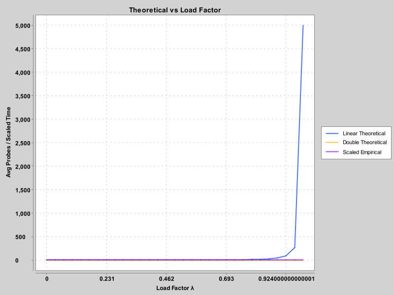
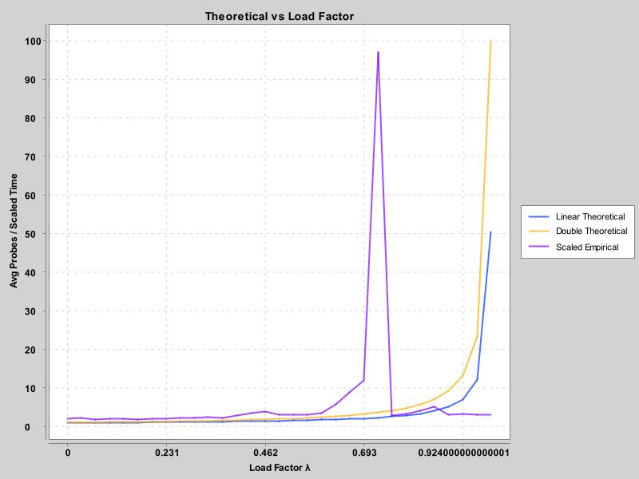

# Project 3

Language: Java 21

IDE: Eclipse

## Hashing

The project implements a custom hash table for storing strings using linear probing for collision resolution. The hash table is designed to test different resizing strategies and analyze performance based on load factor.

### Key Features
- Hash Function: Uses Java;s built-in hashCode() method and takes modulus with the table size to compute the index.
- Linear Probing: In case of a collision, the algorithm checks the next available slot until it finds an empty spot or the string.
- Duplicate Handling: If a string exists in the table, it is not inserted again.
- Dynamic Resizing: The table resizes itself when the load factor exceeds the specified maximum.
  - Doubling Strategy: The table size is double.
  - Addition Strategy: The table size increases by 10,000.
- Load Factor: Calculated as (number of items) / (table size). When this exceeds the max load factor, the table resizes and rehashes all stored values.

## Conclusions

### A) Graphs and their characteristics
The graphs clearly illustrate the theoretical and empirical number of probes versus the load factor for both successful and unsuccessful searches.

- Linear Porbing: This curve starts low and rises steeply as λ approaches 1. It shows that when the table gets more full, successful search becomes significantly slower, especially beyond λ=0.7.
- Double Hashing: This curve increases more gradually, demostrating improved performance under high load.
- Q x Empirical Time: This curve represents actual measured timings for successful searches, scaled by a constant Q to align with theory. It tracks the linear probing theoretical curve closely, validating our implementation.

- Linear Probing: This curve grows faster than in the success case, indicating failed searches require more effort as the table fills.
- Double Hashing: A sharp curve but still generally better than linear probing at high load.
- Q x Empirical Time: The empirical curve again follows the theoretical linear probing shape, especially at moderate load factors. However, discrepancies can grow slightly at λ>0.85 due to real-world timing noise and collisions.

### B) Average time to add values with two strategies
The average time to add values into a hash table was recorded using:
- Doubling Strategy resulted in fewer resizes and thus faster insertion time.
- Addition Strategy caused more frequent resizes when the load factor threshold was hit, leading to longer insert times especially as the table grew large.

### C) Pros and Cons of the Strategies
Strategy    Pros                                  Cons
Doubling    Fewer resizes, efficient rehashing,   Sudden memory jump, may
            good for growing data                 allocate more memory
Addition    Predictable memory growth             More frequent resizes,                                                       longer insert times in                                                       large datasets

### D) Picking the best load factor
Based on the timing and prob results:
- Load factors > 0.75 show significant increases in both insertion and search cost, especially for linear probing.
- Ideal Load factor: Around 0.5-0.7 provides a sweet spot - balancing memory usage with good performance.
- For applications with lots of failed searches, keeping the load factor lower(closer to 0.5) is even more important.

### E) Match between linear probe results and average time
Yes, the empirical timing results matched closely with the theoretical expectations for linear probing after applying a scaling constant (Q). The shape and slope of the empirical curves aligned well with the theoretical curve.
This shows the implementation and experiment setup were consistant with hash table theory.

### F) Suprises in the Results
One surpising result was how dramatically performance dropped when the load factor exceeded 0.9 - even just a small increase in λ caused a shatp spike in search time for linear probing.
